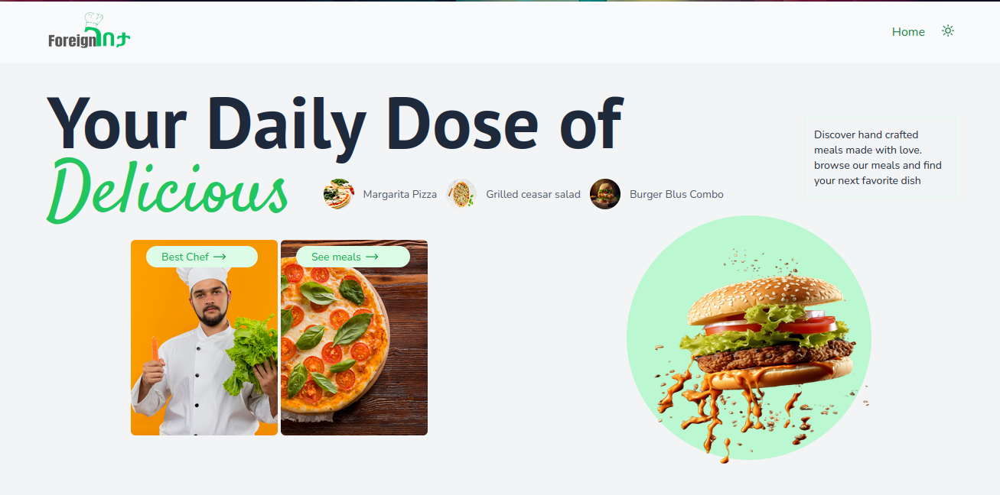
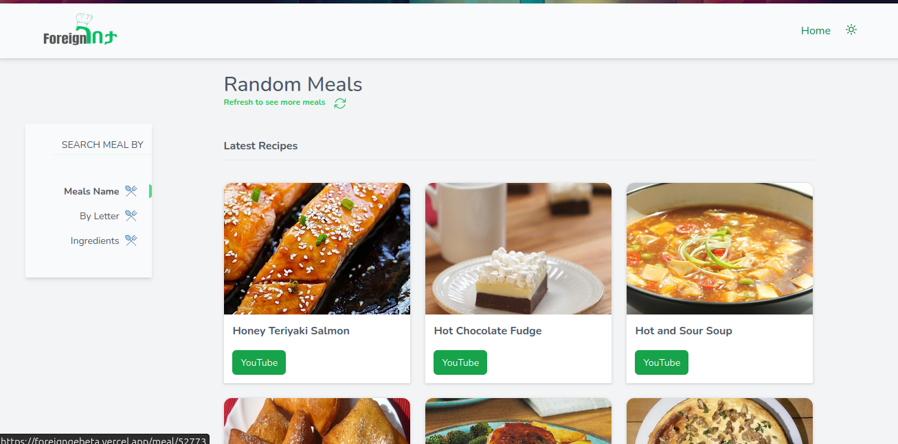
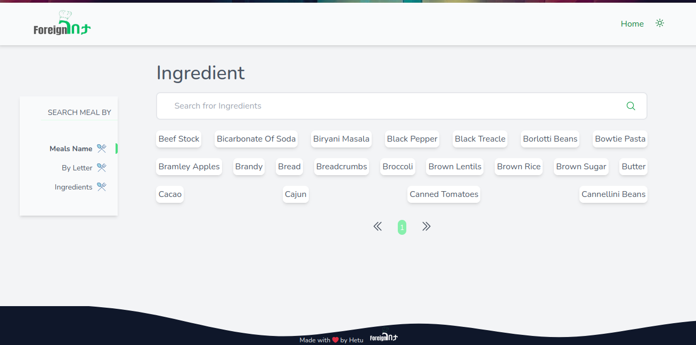

# ForeignGebeta

Welcome to ForeignGebeta! 🍽️ This project is a meal search application built using Vue 3, Pinia for state management, Tailwind CSS, and TheMealDB API. You can search for meals by name, ingredient, and even by letter.

## Features

- **Search by Name:** Find meals by entering their name.
- **Search by Ingredient:** Discover meals that include specific ingredients.
- **Search by Letter:** Explore meals that start with a specific letter.
- **Responsive Design:** Enjoy a seamless experience on any device, thanks to Tailwind CSS.

## Screenshots

### Home Page


### Search Results


### Meal Details


## Installation

1. Clone the repository:
   ```bash
   git clone https://github.com/Nebyat19/recipe-website.git
   cd recipe-website

## Project Setup

```sh
npm install
```

### Compile and Hot-Reload for Development

```sh
npm run dev
```

### Compile and Minify for Production

```sh
npm run build
```

### Lint with [ESLint](https://eslint.org/)

```sh
npm run lint
```

## Usage

1. Open your browser and navigate to `http://localhost:5173`.
2. Use the search bar to find meals by name, ingredient, or letter.
3. Click on a meal to view its details, including ingredients and instructions.

## Technologies Used

- **Vue 3:** A progressive JavaScript framework for building user interfaces.
- **Pinia:** A state management library for Vue.
- **Tailwind CSS:** A utility-first CSS framework for rapid UI development.
- **TheMealDB API:** A free API for meal recipes.

## Contributing

Contributions are welcome! Please fork the repository and create a pull request with your changes.

## License

This project is open-source and available under the [MIT License](LICENSE).

## Acknowledgements

- Thanks to [TheMealDB](https://www.themealdb.com/) for providing the API.

